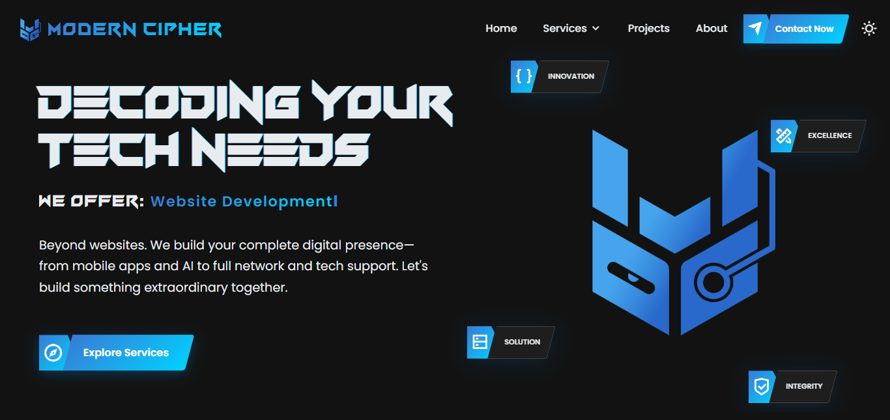
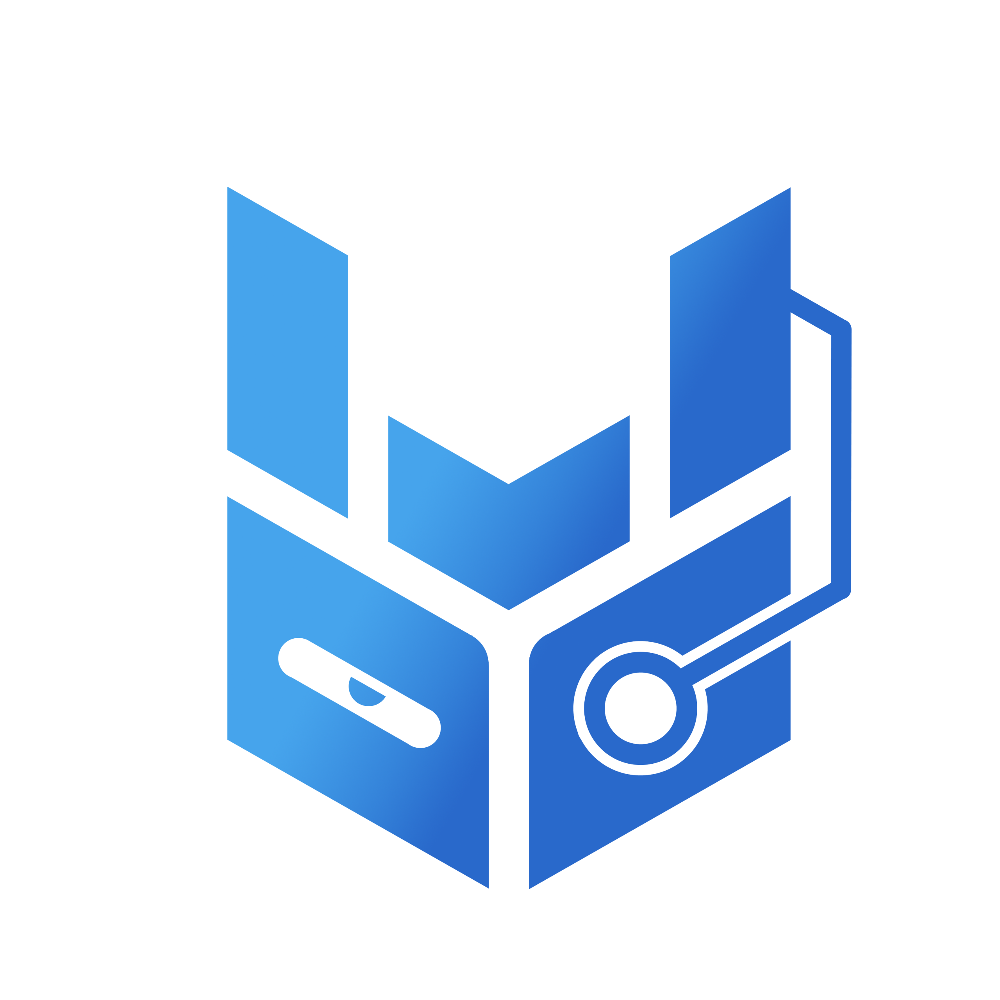

  

  

    <h1 align="center">👋 Hi, I’m Menard Dela Cruz</h1>
    <h3 align="center">Full-Stack Developer | Solutions Architect | Founder of Modern Cipher</h3>

    
    
    

---

<h3>🧑‍💻 About Me</h3>

 
I'm a Full-Stack Developer and the founder of <a href="https://modern-cipher.pages.dev">Modern Cipher</a>, my IT services business.

My expertise lies in building high-performance, scalable web applications from the ground up. I specialize in architecting systems using **MVC patterns** for clean, maintainable code ("clean URL" philosophy) and optimizing performance through robust **caching strategies**. I'm highly proficient in designing and integrating third-party **APIs** and **webhooks**, and experienced in deploying/managing applications on cloud platforms like **GCP** and **AWS**.

Beyond standard development, I build **AI-driven automation tools** (like Google Automation and **Facebook Messenger bots**) and custom scripts to streamline workflows.

I'm also proficient in **Digital Marketing strategies**, including **SEO (Meta Tags, Google Crawl optimization)**, **Google Analytics**, and **AdSense**, to ensure the applications I build are not just functional, but also discoverable and profitable.

- 📫 **How to reach me:** mdctechservices@gmail.com
- 💞️ **I'm looking to collaborate on:** Challenging full-stack projects, custom API integrations, or cloud architecture optimization.
- ⚡ **Fun fact:** I can probably design a decent prototype for an app idea before my coffee gets cold!

<h3>🛠️ Services Offered</h3>

 
<ul>
  <li>🖥️ Website Development & Design (SaaS)</li>
  <li>📱 Mobile App Development</li>
  <li>🤖 AI, Google & Social Media Automation (FB Messenger)</li>
  <li>📈 SEO & Digital Marketing (Analytics, AdSense, Meta Tags)</li>
  <li>📊 Lead Generation & Google Crawl Optimization</li>
  <li>🎨 Graphics Design</li>
  <li>🌐 Network Management & CCTV</li>
  <li>💻 PC & Laptop Repair / Tech Support</li>
</ul>

<h3>🚀 My Technology Stack</h3>

 

  <strong>Frontend:</strong> 
  
  
  
  
  
  
  
  
  
  
  
  

  <strong>Backend:</strong> 
  
  
  
  
  
  
  

  <strong>Mobile Development:</strong> 
  
  
  

  <strong>Databases:</strong> 
  
  
  
  
  

  <strong>Cloud, DevOps & Hosting:</strong> 
  
  
  
  
  
  
  
  

  <strong>CMS, Marketing & SEO:</strong> 
  
  
  
  
  
  

  <strong>AI & Automation:</strong> 
  
  

  <strong>Design & Office Tools:</strong> 
  
  
  
  
  
  
  

  <strong>Development Tools:</strong> 
  
  
  
  
  

<h3>📊 My GitHub Stats</h3>

 

  

 

  

  

  

<h3>🏆 My GitHub Trophies</h3>

 

  

<h3>🐍 Snake Game - My Contribution Graph</h3>

 

  

